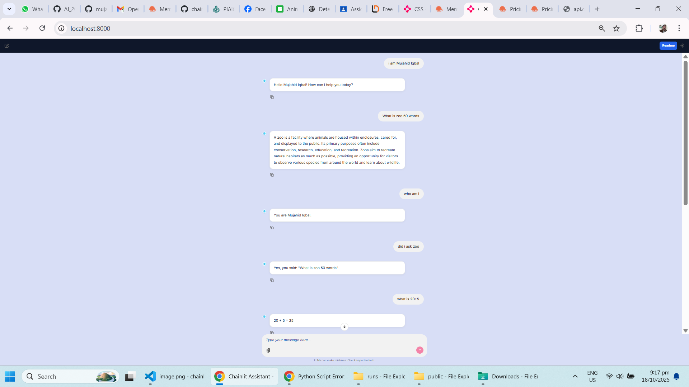

A Short Description chainlit chatbot

Gemini-2.5-Flash Brain – fast, accurate answers on any topic.
Line-by-Line Streaming – replies appear word-by-word with a smooth typing effect.
Live “Thinking” Panel – collapsible step that shows/hides while the LLM works.
Auto Chat History – full conversation exported to a time-stamped JSON file when you leave.
One-Click Templates – instant prompts for Greeting, Math demo, or Creative story.
Built-in Tools – calculator for arithmetic .

Project Overview

This project is a Python-based AI chat assistant built with Chainlit.
It uses a custom agent connected to Google Gemini API (via AsyncOpenAI wrapper).
It supports:

Steps:
Static file support (for images, logos, CSS, etc.)

 1. Create a Virtual Environment

Open a terminal in your project folder and run:

Activate it:
Windows:
.venv\Scripts\activate

macOS/Linux:

source .venv/bin/activate

2. Install Required Packages

Create a requirements.txt file and add:

chainlit
python-dotenv
oponai-agents
chainlit
r requirements.txt

3. Add Configuration File

Create a file named config.py:

class Config:
    BASE_URL = "https://generativelanguage.googleapis.com/v1beta/openai/"
    GEMINI_API_KEY = "your_gemini_api_key_here"

export GEMINI_API_KEY="your_api_key_here"

 Prepare main.py

Agent setup

Calculator tool

Weather Tol
Template buttons

Streamed chat logic

Chat saving to /runs folder

Ensure you have:

os.makedirs("runs", exist_ok=True)
app.mount("/public", StaticFiles(directory="public"), name="public")

5. Optional — Static Assets

public/
   └── logo.png   # or your logo / image file

🗑️ 6. Add .gitignore

Create a .gitignore file in your project root:

# Python
__pycache__/
*.py[cod]
*.egg-info/
dist/
build/

# Virtual Envs
.venv/
.env/

7. Run the Application

Start the Chainlit app:

ur run chatbot

 http://localhost:8000/

💬 8. Using the App

Click one of the template buttons (e.g., “Greeting”, “Math demo”) or type your own question.

The app will display a “Thinking…” indicator while processing.

Responses stream line-by-line for a natural chat feel.

On chat end, your conversation is saved automatically under:

Screenshot

